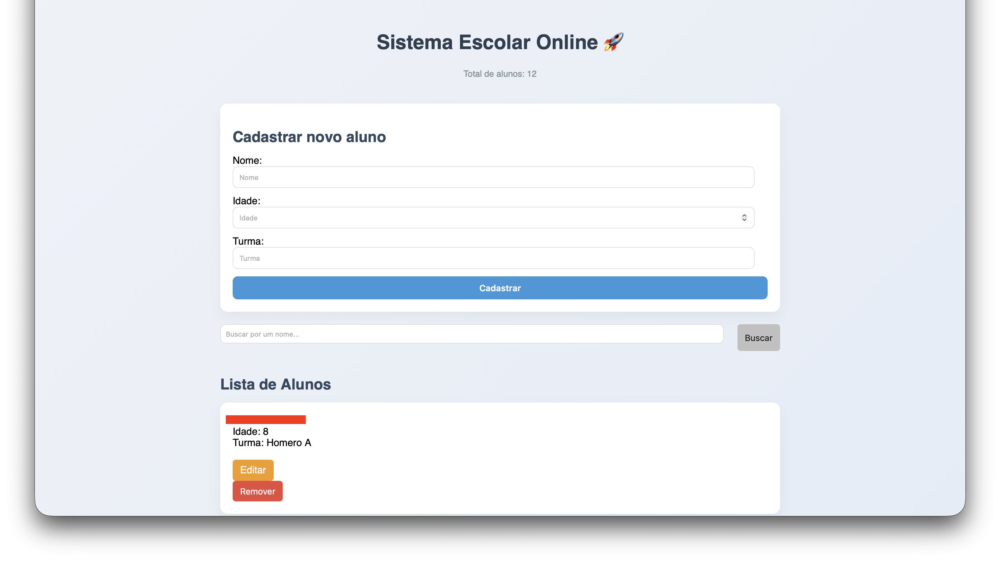
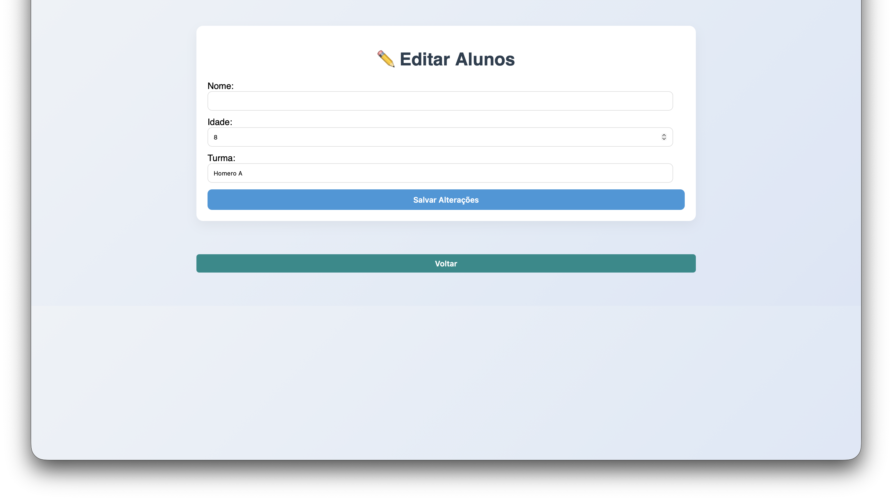

# Homero

Sistema escolar desenvolvido em Python com Flask.

Projeto criado como exercício prático de desenvolvimento web backend.

## Funcionalidades

- Cadastro de alunos
- Edição de alunos
- Remoção de alunos
- Busca por nome
- Persistência em banco SQLite

## Tecnologias utilizadas

- Python
- Flask
- SQLite
- HTML
- CSS
- Git / GitHub

## Como executar o projeto

Clone o repositório:

git clone https://github.com/bobpontes/Homero.git

Entre na pasta do projeto:

cd Homero

Instale as dependências:

pip install -r requirements.txt

Execute a aplicação:

python app.py

Abra no navegador:

http://127.0.0.1:5000

## Interface



# Homero — Sistema de Gestão Escolar

Homero é um sistema de gestão escolar desenvolvido em Python com Flask, criado inicialmente como projeto prático e evoluído para uso real em ambiente escolar.

O objetivo do sistema é centralizar e facilitar o controle financeiro e administrativo de uma escola de forma simples, organizada e eficiente.

---

## 🚀 Funcionalidades

### 👨‍🎓 Alunos
- Cadastro de alunos
- Edição de dados
- Remoção de alunos
- Busca por nome

### 💰 Financeiro (Mensalidades)
- Geração de mensalidades por aluno
- Parcelamento automático
- Registro de pagamento (com data e método)
- Controle de status: pendente, pago e vencido
- Exclusão individual ou em grupo de parcelas

### 📉 Contas a pagar
- Cadastro de despesas
- Parcelamento de contas
- Associação com plano de contas
- Associação com fornecedores
- Controle de vencimento e pagamento

### 📊 Dashboard financeiro
- Total de receitas e despesas
- Valores em aberto
- Filtros por período (mês, intervalo de datas)
- Organização por status

### 🗂 Plano de contas
- Estrutura por categorias
- Classificação por tipo: receita, despesa e transferência

---

## 🛠 Tecnologias utilizadas

- Python
- Flask
- SQLite
- HTML
- CSS (Glass UI)
- JavaScript (modais e interações)
- Git / GitHub

---

## ▶️ Como executar o projeto

Clone o repositório:

```
git clone https://github.com/bobpontes/Homero.git
```

Entre na pasta do projeto:

```
cd Homero
```

Crie e ative um ambiente virtual (opcional, recomendado):

```
python3 -m venv venv
source venv/bin/activate
```

Instale as dependências:

```
pip install -r requirements.txt
```

Execute a aplicação:

```
python app.py
```

Abra no navegador:

```
http://127.0.0.1:5000
```

---

## 🧠 Estrutura do projeto

- `app.py` → aplicação principal Flask
- `templates/` → páginas HTML
- `static/` → arquivos CSS e JS
- `escola.db` → banco SQLite
- `seed.sql` → dados iniciais (plano de contas)

---

## 📦 Status do projeto

🚧 Em desenvolvimento contínuo

O sistema já é utilizável para:
- controle de alunos
- controle financeiro básico

Próximos passos:
- contas a receber
- melhorias de UI/UX
- relatórios avançados
- integração com APIs bancárias (ex: boletos)

---

## 💡 Visão do projeto

Homero está evoluindo de um projeto de estudo para um sistema real de gestão escolar, com foco em:

- simplicidade
- organização
- usabilidade
- estética inspirada em interfaces modernas (macOS / glass UI)

---

## 📸 Interface

*(imagens serão atualizadas em breve)*

---

## 🤝 Contribuição

Projeto pessoal em evolução. Sugestões e melhorias são bem-vindas.

---

## 📄 Licença

Uso livre para fins educacionais e pessoais.